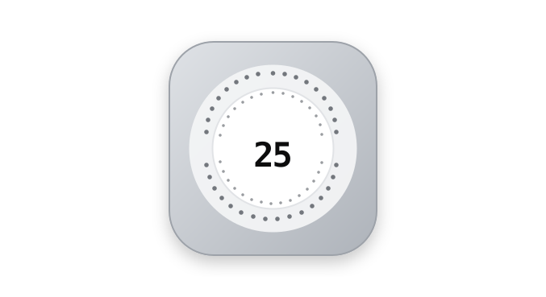
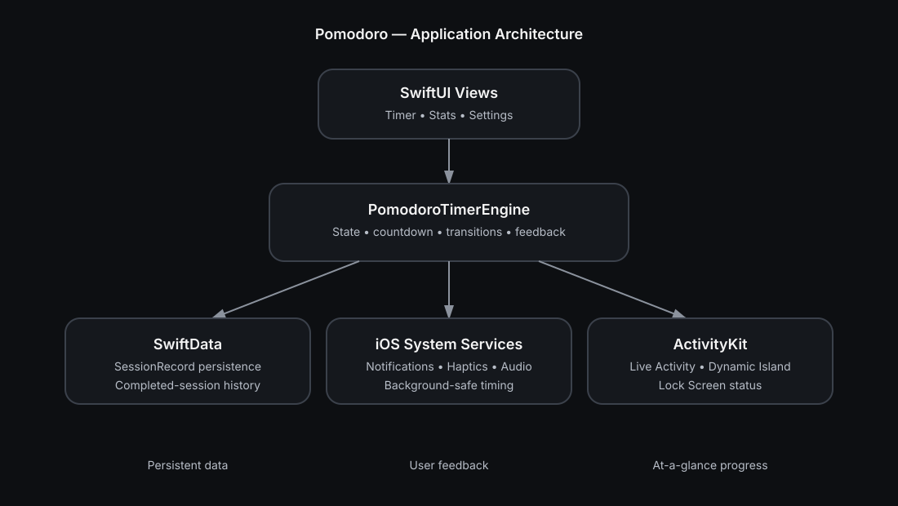
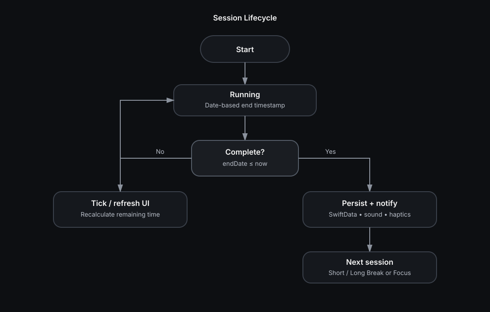

<div align="center">
  

  # Pomodoro

  **A native iOS focus timer built around simple sessions, reliable timing, and deep system integration.**

  Track focused work, move naturally through breaks, and keep your current session visible through native iOS surfaces.

  <p>
    
    
    
    
  </p>
</div>

---

## ✨ Why Pomodoro?

Pomodoro is a focused, native-first productivity app for iPhone. Instead of treating the countdown as a simple UI animation, the app models the session around a real end timestamp, persists completed work, and connects the timer to iOS feedback and Live Activities.

The result is a small project that demonstrates several practical pieces of modern Swift development in one place:

- SwiftUI application architecture
- SwiftData persistence
- ActivityKit / Live Activities
- Local notifications
- Haptics and audio feedback
- State-driven timer logic
- Background/suspension-aware countdown behavior

---

## 🚀 Features

### ⏱️ Focus & Break Sessions

- Focus sessions
- Short breaks
- Long breaks
- Configurable session lengths
- Configurable cycles before a long break
- Pause, reset, skip, and cancel controls
- Optional automatic session transitions

### 📊 Productivity Tracking

- Completed-session history with SwiftData
- Daily completed focus-cycle count
- Statistics view for reviewing progress
- Completed/incomplete session state

### 📱 Native iOS Integration

- Live Activities
- Dynamic Island presentation
- Lock Screen session status
- Local notifications when sessions finish
- Haptic feedback
- Audio feedback

### ⚙️ Personalization

The settings model currently exposes:

| Setting | Default |
|---|---:|
| Focus | 25 min |
| Short Break | 5 min |
| Long Break | 20 min |
| Cycles before Long Break | 4 |
| Auto-start next session | On |
| Auto-start grace period | 8 sec |
| Sound | On |
| Haptics | On |
| Notifications | On |

---

## 🧠 Timing Design

A key implementation detail is that the countdown is **date-based rather than tick-based**.

When a session starts, the engine records an `endDate`:

```swift
sessionEndDate = Date().addingTimeInterval(duration)
```

The UI can refresh frequently, but the remaining time is always calculated from the real end timestamp:

```swift
timeRemaining = max(0, sessionEndDate.timeIntervalSinceNow)
```

### Why this matters

A timer based only on repeated `1-second` ticks can drift when an app is suspended, the device sleeps, or the main run loop is delayed. A timestamp-based design recalculates the remaining duration from the clock instead.

```text
┌──────────────┐
│ Session Start│
└──────┬───────┘
       │
       ▼
┌──────────────────────┐
│ Store real endDate   │
│ Date + duration      │
└──────────┬───────────┘
           │
           ▼
┌──────────────────────┐
│ Refresh UI frequently│
└──────────┬───────────┘
           │
           ▼
┌────────────────────────────┐
│ remaining = endDate - now  │
└──────────┬─────────────────┘
           │
           ▼
     ┌─────────────┐
     │ Time = 0 ?  │
     └──────┬──────┘
            │ Yes
            ▼
┌───────────────────────────┐
│ Complete → persist →      │
│ notify → select next      │
│ session                   │
└───────────────────────────┘
```

---

## 🏗️ Architecture

The project keeps the UI relatively thin and places the main timer behavior inside `PomodoroTimerEngine`.



### Core responsibilities

| Component | Responsibility |
|---|---|
| `PomodoroTimerEngine` | Timer state, controls, transitions, persistence, feedback, notifications, Live Activity updates |
| `PomodoroSettings` | User-configurable durations and behavior |
| `SessionRecord` | SwiftData model for session history |
| `SessionType` | Focus / short break / long break domain model |
| SwiftUI Views | Timer, statistics, settings, and app navigation |
| ActivityKit files | Live Activity and Dynamic Island presentation |
| `NotificationDelegate` | Notification interaction handling |
| `AudioFeedbackPlayer` | Session-completion audio feedback |

---

## 🔄 Session Lifecycle

Every completed session follows a predictable state transition: run → detect completion → persist → notify → determine the next session.



The timer engine exposes these major states:

```text
idle
  ↓
running
  ├── pause → paused
  ├── reset → idle
  └── completion
        ↓
  awaitingConfirmation(next: ...)
        ↓
      running
        ↓
    completed
```

---

## 📁 Project Structure

```text
Pomodoro/
├── App/
│   └── Pomodoro/
│       ├── Pomodoro.xcodeproj
│       └── Pomodoro/
│           ├── App/
│           │   ├── NotificationDelegate.swift
│           │   └── PomodoroApp.swift
│           │
│           ├── Assets.xcassets/
│           │   └── AppIcon.appiconset/
│           │
│           ├── LiveActivity/
│           │   ├── PomodoroActivityAttributes.swift
│           │   ├── PomodoroHomeScreenWidget.swift
│           │   └── PomodoroLiveActivity.swift
│           │
│           ├── Models/
│           │   ├── PomodoroSettings.swift
│           │   ├── SessionRecord.swift
│           │   └── SessionType.swift
│           │
│           ├── Resources/
│           │   └── Info.plist
│           │
│           ├── ViewModels/
│           │   └── PomodoroTimerEngine.swift
│           │
│           └── Views/
│               ├── ContentView.swift
│               ├── SettingsView.swift
│               ├── StatsView.swift
│               └── TimerView.swift
│
└── docs/
    └── assets/
        ├── pomo-logo.svg
        ├── architecture.svg
        └── session-lifecycle.svg
```

> The exact view list can evolve as the UI grows; the architecture diagram above focuses on the core runtime relationships.

---

## 🛠️ Tech Stack

| Technology | Role |
|---|---|
| **Swift** | Application language |
| **SwiftUI** | Declarative UI |
| **SwiftData** | Local persistence |
| **ActivityKit** | Live Activities / Dynamic Island |
| **UserNotifications** | Session-end notifications |
| **UIKit** | Haptic feedback integration |
| **Swift Charts** | Statistics visualization |
| **Xcode** | Build and development environment |

The project uses the native Apple frameworks available to the application rather than a third-party timer framework.

---

## 💻 Getting Started

### Prerequisites

- macOS
- Xcode 16.4 or newer
- iOS 18.5 or newer target/device
- An Apple development team configured in Xcode for device builds

### 1. Clone the repository

```bash
git clone https://github.com/krshz-sudo/Pomodoro.git
cd Pomodoro
```

### 2. Open the Xcode project

```bash
open App/Pomodoro/Pomodoro.xcodeproj
```

### 3. Configure signing

In Xcode:

1. Select the **Pomodoro** project.
2. Select the **Pomodoro** target.
3. Open **Signing & Capabilities**.
4. Select your Apple development team.
5. Use a unique bundle identifier if Xcode requires one.

### 4. Build and run

Select an iOS Simulator or a connected iPhone and press **Run**.

> Live Activities and some system-level behaviors are best validated on a physical device.

---

## 🎮 Usage

A typical workflow looks like this:

1. Open the **Timer** tab.
2. Start a focus session.
3. Work until the timer completes.
4. Receive sound, haptic, and notification feedback according to your settings.
5. Continue into a short break.
6. After the configured number of focus cycles, take a long break.
7. Review completed focus sessions in **Stats**.
8. Adjust durations and feedback behavior in **Settings**.

### Default cycle

```text
Focus 25m
   ↓
Short Break 5m
   ↓
Focus 25m
   ↓
Short Break 5m
   ↓
Focus 25m
   ↓
Short Break 5m
   ↓
Focus 25m
   ↓
Long Break 20m
   ↺
```

---

## 📲 Live Activities

The app uses **ActivityKit** to expose the current session outside the main application UI.

A Live Activity can communicate:

- Current session type
- Session title
- Remaining countdown
- Current status
- Compact Dynamic Island presentation
- Expanded Dynamic Island presentation
- Lock Screen presentation

This keeps the timer useful while the user is working in another app.

---

## 🔔 Notifications & Feedback

When a session completes, the timer engine can coordinate several feedback mechanisms:

```text
Session completes
       │
       ├──► Save SessionRecord
       │
       ├──► Haptic feedback
       │
       ├──► Audio feedback
       │
       ├──► Local notification
       │
       └──► Choose next session
```

Each feedback mechanism can be enabled or disabled from settings.

---

## 🧩 State Management

The timer engine is a `@MainActor` observable object with published state used by the SwiftUI interface.

Conceptually:

```text
UI
 │
 │ user action
 ▼
PomodoroTimerEngine
 │
 ├── timer state
 ├── current session
 ├── remaining time
 ├── cycle count
 ├── SwiftData persistence
 ├── notifications
 ├── audio / haptics
 └── ActivityKit
```

This keeps timer behavior centralized instead of duplicating session logic across views.

---

## 🎨 Documentation Assets

The repository includes lightweight SVG documentation assets so GitHub can render the architecture without requiring external diagram software.

- `docs/assets/pomo-logo.svg` — project branding
- `docs/assets/architecture.svg` — runtime architecture
- `docs/assets/session-lifecycle.svg` — timer/session flow

All diagrams are intentionally simple and source-controlled, making them easy to update alongside the implementation.

---

## 🤝 Contributing

Contributions are welcome.

### Suggested workflow

```bash
git checkout -b feature/your-change
# make your changes
git add .
git commit -m "feat: describe your change"
git push origin feature/your-change
```

Then open a pull request with:

- A clear description of the change
- Screenshots for UI changes
- Testing steps
- Any required configuration changes

### Good contribution areas

- UI polish and accessibility
- Additional statistics
- More flexible session presets
- Widget improvements
- Notification experience
- Tests for timer state transitions
- Localization

---

## 🧪 Development Notes

The timer implementation is deliberately designed around elapsed real time instead of assuming that a scheduled UI tick will execute perfectly.

The repository also keeps the domain model small:

- `SessionType` defines the session categories.
- `PomodoroSettings` owns user preferences.
- `SessionRecord` represents persisted history.
- `PomodoroTimerEngine` coordinates runtime behavior.

This separation makes the project easier to extend without moving business logic into individual SwiftUI views.

---

## 📌 Current Scope

Pomodoro is currently a native iOS project rather than a cross-platform application. The repository is focused on demonstrating a polished timer experience and modern Apple-platform development patterns.

The project currently has **no explicit open-source license file**. If this repository is intended for public reuse, add a license that matches the author's intended permissions.

---

## 👤 Author

**Utkarsh Singh**  
GitHub: `krshz-sudo`

---

<div align="center">

  **Built with SwiftUI. Designed for focus.**

  <sub>Keep the session simple. Keep the work moving.</sub>

</div>
